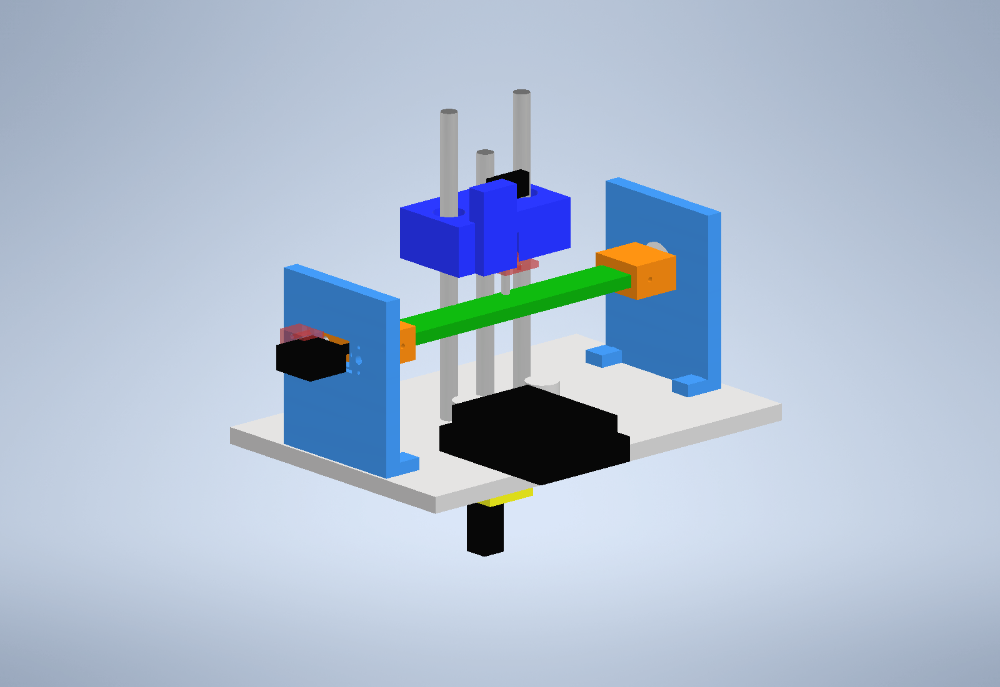

# Messstand für Zugproben — Kontakt-Mikrometer (v5)

Autonomes Messgerät für flache **Zugproben (Dogbone, 166 × 20/12 × 6 mm)**:
misst **Dicke und Breite** berührend mit **einem** DC-Motor.

**Prinzip:** Motor + Encoder + T8-Spindel bilden eine Mikrometerschraube
(0,5 µm/Count). Ein federnder **Taststift** mit **Mikroschalter** tastet die
Probe von oben an; ein **Servo** dreht die Probe (0°/90°/180°), ein federnder
**Rastbolzen** definiert die Winkel exakt. Maße entstehen aus Encoder-Differenzen:
`Maß = |2C − (Z_a + Z_b)| · k` — zentrierungs-unempfindlich, einmalige
Endmaß-Kalibrierung. Genauigkeit: **±0,015–0,03 mm** Wiederholbarkeit,
eine Messung ≈ **40 s** (jede Seite 3× angetastet, Mittelwert).



## 📁 Struktur

| Ordner | Inhalt |
|--------|--------|
| `cad/` | Inventor-Quellen: **Messstand_v4.iam** (Gesamt-Baugruppe) + alle .ipt |
| `stl/` | **druckfertige STLs** (12 Teile) + Druck-/Montage-Anleitung |
| `gesliced/` | fertig gesliced für **Bambu Lab H2C** (.gcode.3mf, PETG, 0,2 mm) |
| `firmware/` | `messprogramm.ino` (Arduino Uno + Pololu MAX14870-Shield) |
| `scripts/` | PowerShell-Skripte, die alle Teile per Inventor-COM erzeugen |
| `scripts/archiv/` | Skripte früherer Versionen |
| `docs/` | Renderings der Baugruppe |
| `archiv/` | alte Teile/Konzepte (ToF-Variante v3, Sensorarm, …) |

**Anleitungen:** [Bausatz_Anleitung.md](Bausatz_Anleitung.md) (Bestellliste ~78 €,
Verkabelung, Montage, Kalibrierung) · [stl/00_ANLEITUNG.txt](stl/00_ANLEITUNG.txt)
(Druck-Orientierung, Zusammenbau) · [Projektverlauf.md](Projektverlauf.md)
(alle Entscheidungen chronologisch).

## 🔌 Verkabelung (Kurzfassung)

```
Pololu Dual MAX14870 Shield auf Arduino Uno
  M1A/M1B  -> Motor (Waveshare N20 12V 1:150, MIT Encoder!)
  VIN/GND  -> 12 V
Encoder A/B -> Pin 2/3   |  Mikroschalter -> A0/GND
Servo SG90  -> Pin 6     |  (Shield belegt 4,7,8,9,10,12)
```

## ⚙️ Inbetriebnahme

1. `STEIGUNG` in der Firmware an die Spindel anpassen (T8x2 → 2.0) —
   Prüftest: 10 Umdrehungen = 20 mm Weg.
2. `s` — Servo-Positionen justieren, bis der Rastbolzen sauber einrastet.
3. `k` — Dicke kalibrieren (Endmaß bekannter Dicke einspannen).
4. `w` — Breite kalibrieren (Endmaß bekannter Breite, Klemmschrauben angezogen).
5. `m` — messen. `1`–`9` wählt die Zahl der Durchläufe (Standard 1 ≈ 40 s,
   `3` ≈ 2 min für ±15 µm).

## 🖨 Drucken

Alles in `stl/` je 1× (Fensterdeckel 2×), PETG/PLA+, 0,2 mm, 4 Wände, 40 % Infill.
Für den **Bambu Lab H2C** liegen in `gesliced/` fertige Platten
(`Alles_Eine_Platte.gcode.3mf` = alle 13 Teile, ~7,2 h, 331 g — einfach per
USB-Stick an den Drucker). Teile neu erzeugen: `scripts\build_v4b_teile.ps1`
(braucht Autodesk Inventor).
